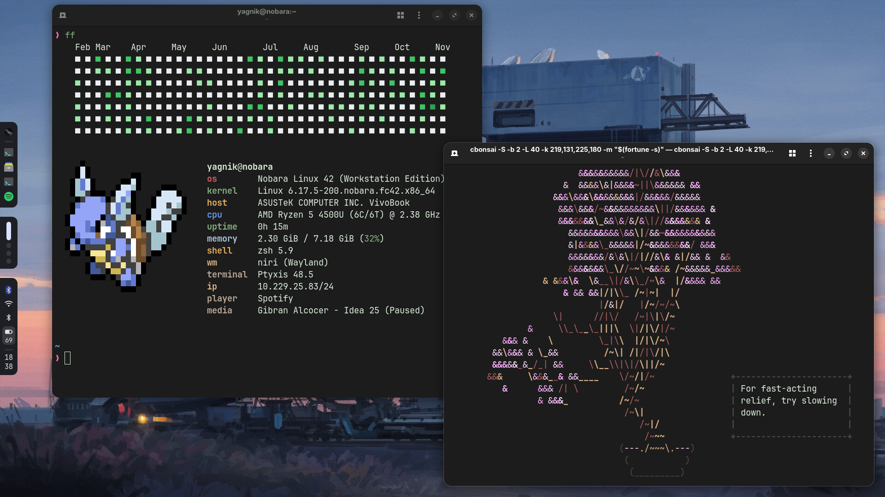
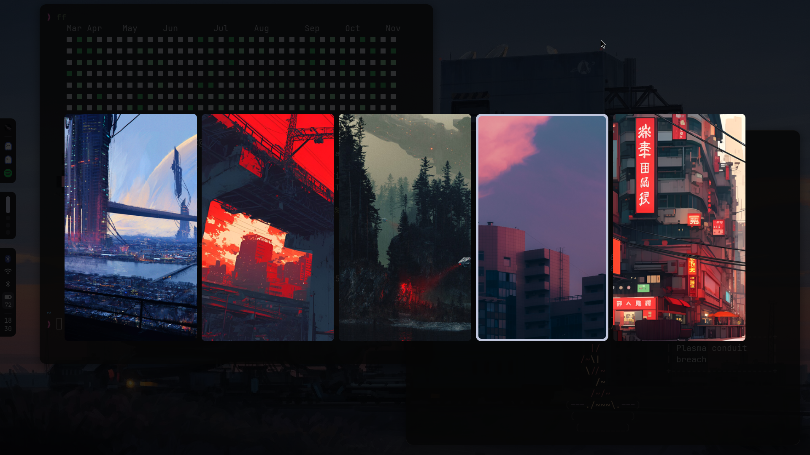

# My Dotfiles

Welcome to my personal dotfiles repository! This repository contains my configuration files for various applications and tools, managed with [GNU Stow](https://www.gnu.org/software/stow/).

## What are Dotfiles?

Dotfiles are plain text configuration files on Unix-like systems that control the look and behavior of your shell, applications, and overall system. They are typically hidden files (prefixed with a dot, e.g., `.zshrc`).

## Installation

**Warning**: These dotfiles are highly personalized and may overwrite your existing configurations. Review them carefully before applying.

1.  **Install GNU Stow:**
    Make sure you have `stow` installed on your system. You can usually install it with your package manager (e.g., `sudo apt-get install stow`, `sudo pacman -S stow`).

2.  **Clone the repository:**
    ```bash
    git clone https://github.com/yagnikpt/dotfiles.git ~/dotfiles
    ```

3.  **Backup your existing dotfiles (optional but recommended):**
    Before stowing, it's a good idea to back up any existing configurations.

4.  **Stow the dotfiles:**
    From within the `~/dotfiles` directory, run:
    ```bash
    stow -v fastfetch gammastep ghostty hypr kitty mako matugen niri rofi scripts waybar zsh
    ```
    This command will create symlinks for all the configurations in the appropriate locations.

5.  **Install dependencies:**
    Ensure you have all necessary applications and fonts installed for these configurations to work correctly.

## Contents

This repository includes configurations for:

*   **fastfetch**: System information tool.
*   **gammastep**: Screen temperature adjustment.
*   **ghostty**: GPU-accelerated terminal emulator.
*   **hypr**: Hyprland Wayland compositor.
*   **kitty**: Fast, feature-rich, GPU based terminal emulator.
*   **mako**: Lightweight Wayland notification daemon.
*   **matugen**: Material You color palette generator.
*   **niri**: A scrollable-tiling Wayland compositor.
*   **rofi**: A window switcher, application launcher, ssh launcher and dmenu replacement.
*   **scripts**: Various utility scripts.
*   **waybar**: Highly customizable Wayland bar for Sway and Wlroots based compositors.
*   **zsh**: Zsh shell configuration.

## Screenshots




## Credits

*   Inspired by various dotfiles repositories on GitHub.
*   Thanks to the developers of all the amazing open-source tools configured here.
