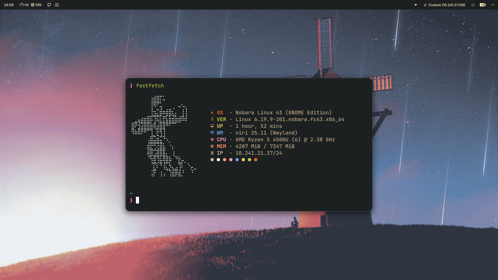
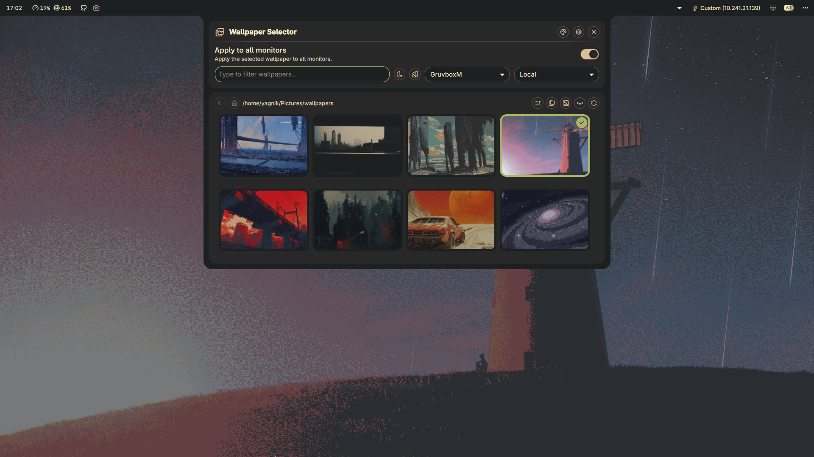
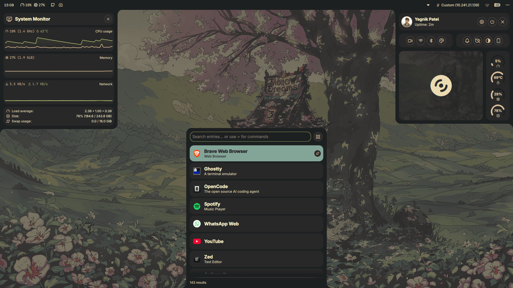

# Dotfiles

Personal Linux desktop setup (Niri + Noctalia), managed with [Tuckr](https://github.com/RaphGL/Tuckr).

Use at your own risk: this is tuned for my machine and can overwrite existing config.

## Install

```bash
git clone https://github.com/yagnikpt/dotfiles.git ~/.dotfiles
cd ~/.dotfiles
tuckr add \*
```

Notes:
- Install required apps/fonts first.
- Some colors/assets are generated from `Configs/matugen/` and may need regeneration on your machine.
- Desktop shell is usually `Noctalia` now; the older barebones setup is still available.

## What's here

`Configs/`
- `niri`, `waybar`, `rofi`, `mako`, `gammastep`
- `zsh`, `ghostty`, `kitty`, `fastfetch`
- `hypr` (hypridle/hyprlock), `scripts`, `matugen`

`Services/`
- user services for startup/background tasks (for example: waybar toggle, swww, gammastep, backups, noctalia)

Shell switch:
- `Configs/scripts/scripts/rofi/modules/desktop.sh` lets you switch between `Custom` (barebones) and `Noctalia`.

## Screenshots





More: [post 1](https://www.reddit.com/r/unixporn/comments/1rzpaoh/niri_noctalia_with_gruvbox_for_the_win), [post 2](https://www.reddit.com/r/unixporn/comments/1oqngoz/niri_minimalist_niri_setup)
